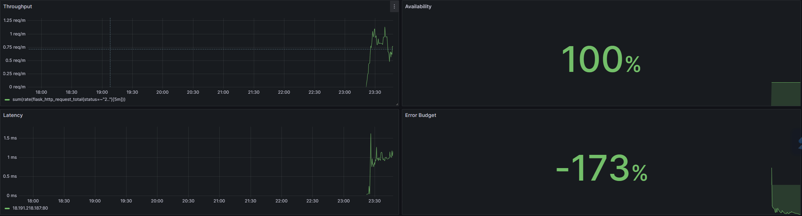

## Availability SLI
### The percentage of successful requests over the last 5m
sum(rate(flask_http_request_total{job="ec2", status!="5.."}[5m])) / sum(rate(flask_http_request_total{job="ec2"}[5m]))

## Latency SLI
### 90% of requests finish in these times
histogram_quantile(0.90, sum by(le,instance) (rate(flask_http_request_duration_seconds_bucket[7d])))

## Throughput
### Successful requests per second
sum(rate(flask_http_request_total{status=~"2.."}[5m]))

## Error Budget - Remaining Error Budget
### The error budget is 20%
1- ((1 - (sum(rate(flask_http_request_total{job="ec2", status=~"2.."}[1d])) / sum(rate(flask_http_request_total{job="ec2"}[1d])))) / 0.20)

